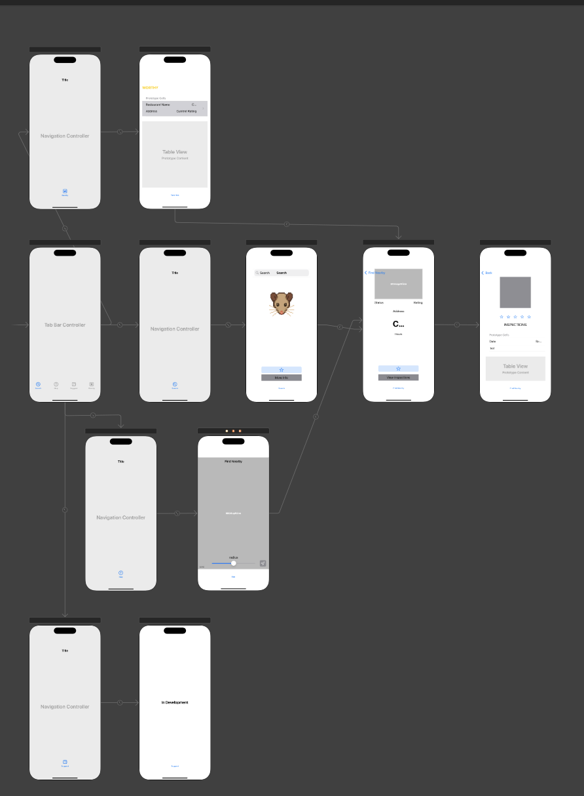

# RAT

## Table of Contents
1. [Overview](#overview)  
2. [Product Spec](#product-spec)  
3. [Wireframes](#wireframes)  
4. [Schema](#schema)  

## Overview  
**Description**  
This app allows a user to search for restaurants in the NYC area. In doing so, they are able to find the current health rating along with previous health ratings and the subsequent health violations recorded during inspections. The purpose of this app is to promote public awareness and transparency for those who want to know what is happening at their favorite spots.

## Product Spec
### Screen Archetypes and Stories
### [x] 1. Search Scene 
- The user enters the name of a restaurant; Google’s Places SDK will autofill the address.  
- After a query to Google Places and NYC Open Data, a brief overview will be shown, displaying the current grade, Google rating, and current open status.  
- A “Worthy” button adds the restaurant to the user’s Worthy list.  
- A “More Info” button takes the user to a new screen, **Details**, with additional information such as hours and address.
- A table view showing up to 5 recently viewed restaurants, clicking on a cell takes user to Details screen (a)

#### [x] a. Details Screen  
- The Details screen highlights the Google rating, open status, hours, and address.  
- A “View Violations” button takes the user to a new screen, **Violations**, with additional information.  

#### [x] b. Violations Screen  
- The Violations screen highlights the current grade.  
- A table view shows all previous inspection dates with corresponding violations and a calculated score, starting from 100 and subtracting the points lost per violation.  
- A color scheme represents each grade: green for an A (close to 100), yellow for a B (around 87), and red for a C (around 72).  

### [x] 2. Map Scene  
- The user is prompted to share their location with the application so that it can generate pins for nearby restaurants.  
- Upon selecting a pin, the user can view additional details of the chosen establishment.  
- The user may re-center the map if they zoom far from their location.  
- The user may use a scrollable bar to adjust the radius in which nearby restaurants are searched.  

### [x] 3. Worthy Scene  
- The user can view all restaurants they previously declared “Worthy.”  
- Upon selecting one of the restaurants, the app navigates the user to the Details screen.  
- The user may refresh this list by scrolling down.  
- The user may delete items from this list by swiping left.  

### [ ] 4. Suggest Scene (TBD)  
- The user will be able to select filters (borough, cuisine type, ZIP code, grade, rating), and a list of restaurants matching the filters will be generated.

## Navigation

**Tab Navigation** (Tab to Screen)

* [Search]
* [Map]
* [Suggest]
* [Worthy]

**Flow Navigation** (Screen to Screen)

- [x] [Search]
* [Details]
* [Inspections]
- [x] [Map]
* [Details]
* [Inspections]
- [x] [Worthy]
* [Details]
* [Inspections]


##App Evaluation
[Evaluation of your app across the following attributes]

Mobile
- Uses **maps**, **location**, and **real-time API data** (NYC Open Data + Google Places).
- Designed for **on-the-go** use — perfect for users checking restaurants nearby before entering.
- **Interactive features** like the map radius slider and pin selection are native to mobile.

Story
- Promotes **public health awareness** and **transparency**.
- The “Worthy” list feature adds a **personal connection** to the app experience.
- Easily relatable for your audience: **urban foodies, tourists, and locals alike**.

Market
- NYC has **thousands of restaurants and millions of residents/tourists**.
- Provides **huge value to a niche** (those who care about restaurant cleanliness and ratings).
- Potential to **scale to other cities** using similar datasets.

Habit
- Users may not check it daily, but **frequent usage around dining out** is likely.
- The “Worthy” list introduces personalization and engagement.

Scope
- Core scenes are defined: **Search**, **Details**, **Violations**, **Map**, **Worthy**, and **Suggest** (TBD).
- MVP (Search + Worthy + Violations) is **already functional and meaningful**.
- Uses manageable technologies: **Google SDK**, **NYC Open Data**, **UIKit/MapKit**.

## Wireframes  
### Initial Design  


### Second Design  


### Final Design  


## Schema  
    - The only data saved on a user’s phone is a list of restaurants they save to their “Worthy” list.
    - Implemented an additional list of recently viewed restaurants (limited to 5)

```swift
struct FavoriteRestaurant: Codable {
    let name: String
    let grade: String?
    let rating: Double?
    let camis: String
    let address: String
    let placeID: String
}
```
```swift
struct RecentRestaurant: Codable {
    let name: String
    let camis: String
    let address: String
    let placeID: String
    let grade: String?
    let rating: Double?
    let viewedAt: Date
}
```


## DEMO

[Demo](https://youtube.com/shorts/-a4BQtIlZHE?feature=share)

## Networking
 - NYC OPEN DATA API (DOHMH New York City Restaurant Inspection Results)
 - Google Places API, Google Places SDK
